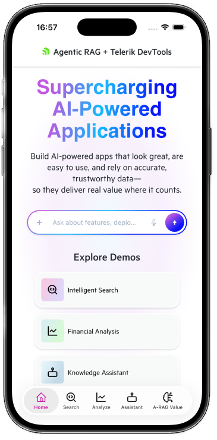
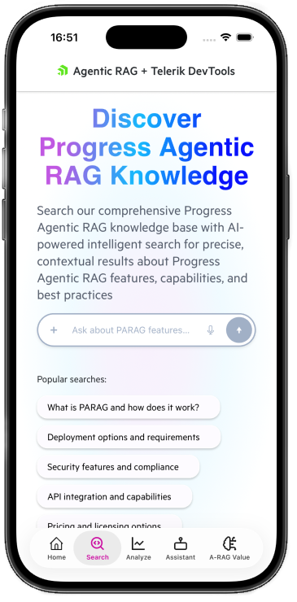
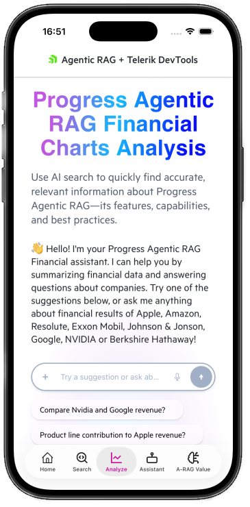
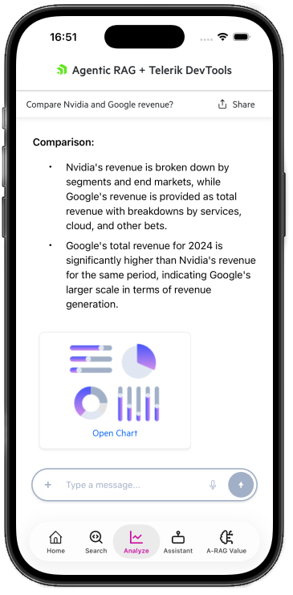
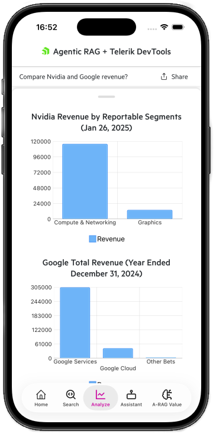
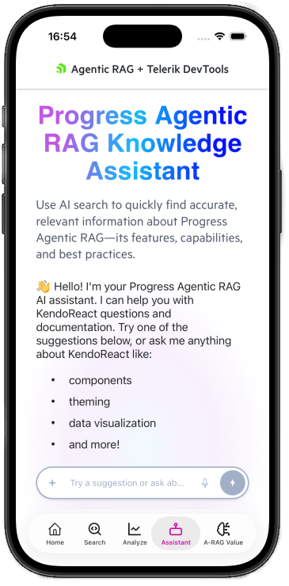
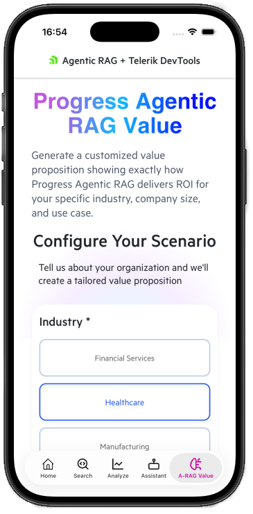
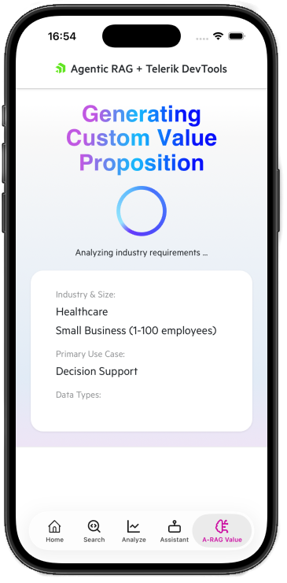

# Progress Agentic RAG + Telerik UI for .NET MAUI Demo

A comprehensive demo application showcasing the powerful integration between **Progress Agentic RAG AI-powered search capabilities** and **Telerik UI for .NET MAUI components**. This application demonstrates how to build intelligent, data-driven cross-platform mobile and desktop interfaces that combine enterprise-grade AI retrieval with beautiful, functional user interfaces.

## 🚀 Product Links

- **[Progress Agentic RAG](https://www.progress.com/agentic-rag)** - Enterprise-grade AI-powered search and retrieval
- **[Telerik UI for .NET MAUI](https://www.telerik.com/maui-ui)** - Professional UI components for .NET MAUI applications

## 📋 Overview

This demo application illustrates how to:

- Integrate Progress Agentic RAG with .NET MAUI applications
- Build intelligent search experiences with AI-powered responses
- Create interactive data visualizations with AI-generated insights
- Develop conversational AI interfaces with streaming responses
- Generate customized content based on user inputs
- Deploy cross-platform AI-powered applications (Android, iOS, Windows, macOS)

## 📸 Screenshots

### Desktop & Mobile Views

<table>
  <tr>
    <td width="50%">
      
      <p align="center"><strong>Mobile View</strong></p>
    </td>
    <td width="50%">
      
      <p align="center"><strong>Desktop View</strong></p>
    </td>
  </tr>
</table>

### iOS Screenshots - All Pages

<details>
<summary>Click to view iOS screenshots</summary>

<table>
  <tr>
    <td width="33%">
      
    </td>
    <td width="33%">
      
    </td>
    <td width="33%">
      
    </td>
  </tr>
  <tr>
    <td width="33%">
      
    </td>
    <td width="33%">
      
    </td>
    <td width="33%">
      
    </td>
  </tr>
  <tr>
    <td width="33%">
      
    </td>
    <td width="33%">
      
    </td>
    <td width="33%">
      
    </td>
  </tr>
</table>

</details>

## 🏗️ Architecture

```
┌─────────────────────────────────────────────────────────────────────┐
│                 .NET MAUI Application (Cross-Platform)              │
├─────────────────────────────────────────────────────────────────────┤
│  ┌─────────────────┐  ┌─────────────────┐  ┌─────────────────────┐  │
│  │   Pages (XAML)  │  │    ViewModels   │  │    Services         │  │
│  │                 │  │                 │  │                     │  │
│  │  - HomePage     │  │  - HomeViewModel│  │  - NucliaSearch     │  │
│  │  - Intelligent  │  │  - Intelligent  │  │    Service          │  │
│  │    SearchPage   │  │    SearchVM     │  │  - ToastMessage     │  │
│  │  - Financial    │  │  - Financial    │  │    Service          │  │
│  │    AnalysisPage │  │    AnalysisVM   │  │                     │  │
│  │  - Knowledge    │  │  - Knowledge    │  │                     │  │
│  │    AssistantPage│  │    AssistantVM  │  │                     │  │
│  │  - AgenticRag   │  │  - AgenticRag   │  │                     │  │
│  │    ValuePage    │  │    ValueVM      │  │                     │  │
│  └─────────────────┘  └─────────────────┘  └─────────────────────┘  │
│  ┌─────────────────────────────────────────────────────────────┐    │
│  │              Views & Controls (Reusable)                    │    │
│  │  - ChatView · MarkdownView · GradientTextView               │    │
│  │  - ShellTitleView · CodeBlockView · PopularSearchesView     │    │
│  │  - FinancialChartsView                                      │    │
│  └─────────────────────────────────────────────────────────────┘    │
│  ┌─────────────────────────────────────────────────────────────┐    │
│  │              Behaviors (Reusable)                           │    │
│  │  - BusyIndicatorAnimationBehavior                           │    │
│  │  - ChatScrollToBottomBehavior                               │    │
│  │  - CollectionViewResponsiveLayoutBehavior                   │    │
│  │  - DynamicChartSeriesBehavior                               │    │
│  │  - LabelPointerPressedOverlayBehavior                       │    │
│  │  - ResponsiveGridLayoutBehavior                             │    │
│  │  - SimultaneousTouchBehavior                                │    │
│  │  - ToastMessageOnClickBehavior                              │    │
│  │  - VisualStateFocusBehavior                                 │    │
│  └─────────────────────────────────────────────────────────────┘    │
├─────────────────────────────────────────────────────────────────────┤
│                      Telerik UI for .NET MAUI                       │
│  ┌─────────────────────────────────────────────────────────────┐    │
│  │  RadChat · RadChart · RadButton · RadEntry · RadPopup       │    │
│  │  RadBottomSheet · RadNavigationView · RadBusyIndicator      │    │
│  │  RadPromptInput · RadWrapLayout · RadTemplatedButton · etc. │    │
│  └─────────────────────────────────────────────────────────────┘    │
├─────────────────────────────────────────────────────────────────────┤
│                        Progress Nuclia SDK                          │
│  ┌─────────────────────────────────────────────────────────────┐    │
│  │  NucliaDbClient · AskAsync · AskStreamAsync · Search API    │    │
│  └─────────────────────────────────────────────────────────────┘    │
├─────────────────────────────────────────────────────────────────────┤
│                        Progress Agentic RAG                         │
│  ┌─────────────────────────────────────────────────────────────┐    │
│  │  Knowledge Boxes · AI Search · Streaming Responses          │    │
│  └─────────────────────────────────────────────────────────────┘    │
└─────────────────────────────────────────────────────────────────────┘
```

### Key Components

| Layer | Technology | Purpose |
|-------|------------|---------|
| **Frontend** | .NET MAUI | Cross-platform UI framework for Android, iOS, Windows, and macOS |
| **Architecture** | MVVM Pattern | Model-View-ViewModel separation with data binding |
| **UI Components** | Telerik UI for .NET MAUI | Enterprise-grade UI components (Chat, Charts, Forms, Navigation) |
| **AI Integration** | Progress Nuclia SDK | .NET client for Progress Agentic RAG APIs |
| **AI Backend** | Progress Agentic RAG | AI-powered knowledge retrieval and generation |
| **Platform Services** | Toast Messages | Platform-specific notification services (Android, iOS, Windows) |

## 📱 Demo Pages

### 1. Home Page
The landing page featuring navigation cards to all demo experiences. Users can explore different AI capabilities through an intuitive interface with responsive grid layout.

### 2. Intelligent Search
An AI-powered search interface that:
- Provides intelligent responses to natural language queries about Progress Agentic RAG
- Supports streaming responses for real-time feedback
- Displays AI-generated answers with markdown formatting
- Offers popular search suggestions with reusable `PopularSearchesView` component
- Features responsive layout with smooth transitions between search and results states

### 3. Financial Analysis
A conversational AI assistant for financial data analysis:
- Chat-based interface using Telerik RadChat component
- AI-generated chart visualizations using Telerik RadChart with `DynamicChartSeriesBehavior`
- Financial insights for companies like Apple, Google, NVIDIA, Amazon, and more
- Dynamic chart expansion with RadBottomSheet (mobile) and RadPopup (desktop)
- Side navigation drawer with RadNavigationView showing chat history
- Interactive toast notifications for disabled demo features

### 4. Knowledge Assistant
A documentation assistant that:
- Answers questions about KendoReact and related technologies
- Provides streaming conversational responses
- Features a clean chat interface with message history
- Supports chat suggestions for quick queries
- Uses dedicated Verse Knowledge Box for documentation queries

### 5. Agentic RAG Value Proposition
A dynamic value proposition generator that:
- Creates customized proposals based on user inputs
- Supports industry, company size, data types, and use case selection
- Generates AI-powered content with markdown formatting
- Demonstrates form-based AI interaction patterns

## 🛠️ Technology Stack

- **.NET 9.0** - Latest .NET framework
- **.NET MAUI** - Cross-platform UI framework
- **MVVM Architecture** - Clean separation of concerns with base classes
- **Telerik UI for .NET MAUI** - Professional UI component suite
- **Progress.Nuclia SDK 0.1.0-preview.24** - AI integration library
- **SkiaSharp 3.119.1** - 2D graphics for custom rendering
- **Microsoft.Extensions.Configuration** - Configuration management
- **Microsoft.Extensions.Logging** - Logging infrastructure

## 📦 Prerequisites

Before running this project, ensure you have:

1. **.NET 9.0 SDK** - [Download here](https://dotnet.microsoft.com/download/dotnet/9.0)

2. **Platform-Specific Requirements:**
   - **Android:** Android SDK (API 21 or higher)
   - **iOS/macOS:** macOS with Xcode 15.0 or later
   - **Windows:** Windows 10 SDK (10.0.17763.0 or higher)

3. **Telerik UI for .NET MAUI License or Trial**
   - Visit [Telerik UI for .NET MAUI](https://www.telerik.com/maui-ui) to obtain a license
   - You can start with a [free trial](https://www.telerik.com/download-trial-file/v2-b/maui)
   - The trial provides full access to all components for 30 days

4. **Progress Agentic RAG Account**
   - Sign up at [Progress Agentic RAG](https://www.progress.com/agentic-rag)
   - Create Knowledge Boxes and obtain API keys

## 🚀 Getting Started

### 1. Clone the Repository

```bash
git clone https://github.com/telerik/maui-progress-rag-demo.git
cd maui-progress-rag-demo
```

### 2. Configure NuGet Package Sources

The Telerik packages require the Telerik NuGet feed. Add it to your NuGet configuration:

```bash
dotnet nuget add source "https://nuget.telerik.com/v3/index.json" \
  --name "TelerikNuGet" \
  --username "<your-telerik-email>" \
  --password "<your-telerik-password>"
```

> **Note:** Replace `<your-telerik-email>` and `<your-telerik-password>` with your Telerik account credentials.

### 3. Configure Progress Agentic RAG

Update the `maui-progress-rag-demo/appsettings.json` file with your Progress Agentic RAG credentials:

```json
{
  "NucliaDb": {
    "ZoneId": "europe-1",
    "KnowledgeBoxId": "<your-knowledge-box-id>",
    "ApiKey": "<your-api-key>"
  },
  "NucliaDbCharts": {
    "ZoneId": "aws-eu-central-1-1",
    "KnowledgeBoxId": "<your-charts-knowledge-box-id>",
    "ApiKey": "<your-charts-api-key>"
  },
  "NucliaDbVerse": {
    "ZoneId": "aws-us-east-2-1",
    "KnowledgeBoxId": "<your-verse-knowledge-box-id>",
    "ApiKey": "<your-verse-api-key>"
  }
}
```

> **Security Note:** For production deployments, use environment variables or secure storage instead of storing credentials in configuration files.

### 4. Restore Dependencies

Navigate to the project directory and restore dependencies:

```bash
cd maui-progress-rag-demo
dotnet restore
```

### 5. Run the Application

**For Android:**
```bash
dotnet build -t:Run -f net9.0-android
```

**For Windows:**
```bash
dotnet build -t:Run -f net9.0-windows10.0.19041.0
```

**For iOS (requires macOS):**
```bash
dotnet build -t:Run -f net9.0-ios
```

**For macOS (requires macOS):**
```bash
dotnet build -t:Run -f net9.0-maccatalyst
```

Alternatively, open the solution in Visual Studio 2022 and select your target platform from the dropdown.

## 🔧 Configuration

### Environment Variables

For production deployments, configure the following environment variables:

| Variable | Description |
|----------|-------------|
| `NucliaDb__ZoneId` | Zone ID for the default Knowledge Box |
| `NucliaDb__KnowledgeBoxId` | Knowledge Box ID for general queries |
| `NucliaDb__ApiKey` | API Key for the default Knowledge Box |
| `NucliaDbCharts__ZoneId` | Zone ID for the charts Knowledge Box |
| `NucliaDbCharts__KnowledgeBoxId` | Knowledge Box ID for financial data |
| `NucliaDbCharts__ApiKey` | API Key for the charts Knowledge Box |
| `NucliaDbVerse__ZoneId` | Zone ID for the verse Knowledge Box |
| `NucliaDbVerse__KnowledgeBoxId` | Knowledge Box ID for documentation |
| `NucliaDbVerse__ApiKey` | API Key for the verse Knowledge Box |

### Secure Storage (Mobile Platforms)

For mobile deployments, consider using platform-specific secure storage:
- **Android:** Android Keystore
- **iOS:** iOS Keychain
- Utilize `Microsoft.Maui.Storage.SecureStorage` for cross-platform secure storage

## 📂 Project Structure

```
maui-progress-rag-demo/
├── maui-progress-rag-demo/
│   ├── Pages/
│   │   ├── PageBase.cs                   # Base page with ViewModel lifecycle
│   │   ├── HomePage.xaml                 # Home page
│   │   ├── IntelligentSearchPage.xaml    # Intelligent search
│   │   ├── FinancialAnalysisPage.xaml    # Financial analysis chat
│   │   ├── KnowledgeAssistantPage.xaml   # Documentation assistant
│   │   └── AgenticRagValuePage.xaml      # Value proposition generator
│   ├── ViewModels/
│   │   ├── ViewModelBase.cs              # Base ViewModel class
│   │   ├── ChatViewModelBase.cs          # Base chat ViewModel
│   │   ├── HomeViewModel.cs
│   │   ├── IntelligentSearchViewModel.cs
│   │   ├── FinancialAnalysisViewModel.cs
│   │   ├── KnowledgeAssistantViewModel.cs
│   │   └── AgenticRagValueViewModel.cs
│   ├── Views/
│   │   ├── ChatView.xaml                 # Reusable chat view
│   │   ├── ShellTitleView.xaml           # Custom shell title
│   │   ├── PopularSearchesView.xaml      # Reusable search suggestions
│   │   └── FinancialChartsView.xaml      # Financial charts display
│   ├── Controls/
│   │   ├── MarkdownView.xaml             # Markdown rendering control
│   │   ├── GradientTextView.xaml         # Gradient text control
│   │   └── CodeBlockView.xaml            # Code block display
│   ├── Services/
│   │   ├── NucliaSearchService.cs        # Progress Agentic RAG integration
│   │   ├── ChartModels.cs                # Chart data models
│   │   ├── Schemas.cs                    # JSON schemas for AI responses
│   │   ├── Interfaces/
│   │   │   └── IToastMessageService.cs   # Toast message interface
│   │   └── ToastMessage/
│   │       ├── ToastMessageService.cs    # Base toast service
│   │       ├── ToastMessageService.Android.cs
│   │       ├── ToastMessageService.iOS.cs
│   │       └── ToastMessageService.Windows.cs
│   ├── Models/
│   │   ├── TelerikChartModel.cs          # Chart data model
│   │   └── NavigationItem.cs             # Navigation model
│   ├── Behaviors/
│   │   ├── BusyIndicatorAnimationBehavior.cs
│   │   ├── ChatScrollToBottomBehavior.cs
│   │   ├── CollectionViewResponsiveLayoutBehavior.cs
│   │   ├── DynamicChartSeriesBehavior.cs # Chart series behavior
│   │   ├── LabelPointerPressedOverlayBehavior.cs
│   │   ├── ResponsiveGridLayoutBehavior.cs
│   │   ├── SimultaneousTouchBehavior.cs
│   │   ├── ToastMessageOnClickBehavior.cs
│   │   └── VisualStateFocusBehavior.cs
│   ├── Helpers/
│   │   ├── MouseHelper.cs                # Platform-specific helpers
│   │   ├── MouseHelper.Windows.cs
│   │   ├── MouseHelper.MacCatalyst.cs
│   │   └── DesktopUtils.cs
│   ├── Resources/                        # App resources (images, fonts, styles)
│   ├── Platforms/                        # Platform-specific code
│   │   ├── Android/
│   │   ├── iOS/
│   │   ├── Windows/
│   │   └── MacCatalyst/
│   ├── MauiProgram.cs                    # Application entry point
│   ├── AppShell.xaml                     # Shell navigation
│   └── appsettings.json                  # Configuration
└── README.md                             # This file
```

## 🎨 Key Features

### MVVM Architecture
- Clean separation between UI and business logic
- Data binding for reactive UI updates
- Reusable ViewModels and Views with base classes
- Lifecycle management with `PageBase` and `ViewModelBase`
- State reset on page navigation for clean user experience

### Cross-Platform Support
- Single codebase for Android, iOS, Windows, and macOS
- Platform-specific optimizations where needed
- Responsive layouts for different screen sizes
- Platform-specific services (Toast messages)
- Adaptive UI with `OnPlatform` and `OnIdiom` markup

### Telerik UI Components
- **RadChat:** Rich chat interface with message templates
- **RadChart:** Beautiful, interactive data visualizations
- **RadNavigationView:** Side drawer navigation for desktop
- **RadBottomSheet:** Mobile-optimized chart expansion
- **RadPopup:** Desktop modal dialogs
- **RadBusyIndicator:** Loading states with animations
- **RadPromptInput:** AI-powered input with send functionality
- **RadWrapLayout:** Responsive button layouts
- **RadTemplatedButton:** Customizable buttons with behaviors

### Advanced Behaviors
- **DynamicChartSeriesBehavior:** Dynamically generates chart series from data
- **BusyIndicatorAnimationBehavior:** Custom loading animations
- **ChatScrollToBottomBehavior:** Auto-scroll chat to latest message
- **ResponsiveGridLayoutBehavior:** Adaptive grid layouts
- **CollectionViewResponsiveLayoutBehavior:** Responsive collection layouts
- **ToastMessageOnClickBehavior:** Platform-specific toast notifications
- **SimultaneousTouchBehavior:** Enhanced touch handling
- **VisualStateFocusBehavior:** Focus state management
- **LabelPointerPressedOverlayBehavior:** Visual feedback for interactions

### Reusable Components
- **PopularSearchesView:** Reusable search suggestions component with bindable properties
- **FinancialChartsView:** Standalone financial charts display
- **ChatView:** Generic chat interface for multiple pages
- **MarkdownView:** Markdown rendering with code syntax highlighting
- **GradientTextView:** Stylized gradient text headers
- **CodeBlockView:** Code block display with syntax highlighting

### AI Integration Patterns
- Streaming responses for real-time feedback
- Structured data extraction (JSON schemas)
- Multiple Knowledge Box support for different content types
- Error handling and retry logic
- Platform-agnostic service abstractions

## 🤝 Contributing

Contributions are welcome! Please feel free to submit issues and pull requests.

## 📄 License

This project is provided for demonstration purposes. Please refer to the individual product licenses:

- [Telerik UI for .NET MAUI License](https://www.telerik.com/purchase/license-agreement/maui)
- [Progress Agentic RAG Terms](https://www.progress.com/legal/terms-of-service)

## 📞 Support

- **Telerik Support:** [Telerik Support Center](https://www.telerik.com/support/maui-ui)
- **Progress Agentic RAG:** [Progress Support](https://www.progress.com/support)

---

Built with ❤️ using [Progress Agentic RAG](https://www.progress.com/agentic-rag) and [Telerik UI for .NET MAUI](https://www.telerik.com/maui-ui)